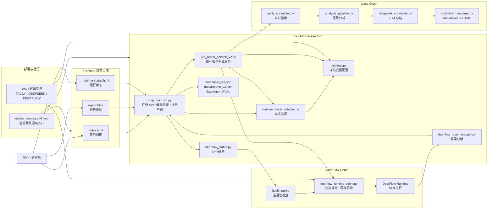
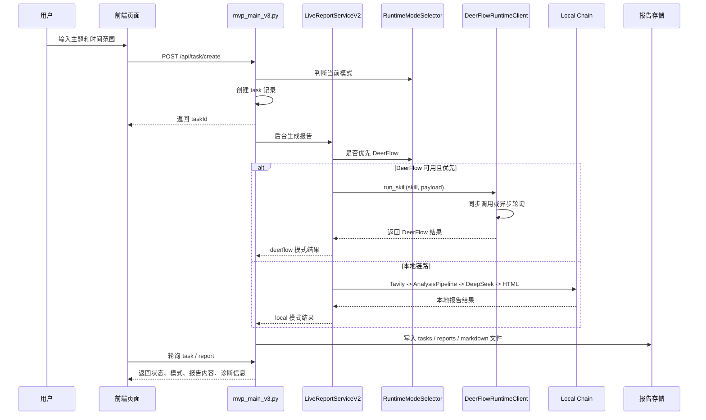

# 项目整体架构图

当前项目推荐以 V3 作为主线，也就是 `app/backend/mvp_main_v3.py` + `live_report_service_v2.py` 这套结构。

## 1. 总体架构

## 2. 一次任务的执行流

## 3. 关键职责划分

- 我们自己的应用负责：任务记录、报告存储、状态展示、前端页面、调度入口。
- DeerFlow 负责：执行编排、技能运行、多步任务处理。
- 本地链路负责：在 DeerFlow 不可用或未配置时，继续完成报告生成。

## 4. 关键入口文件

- 后端主入口：`app/backend/mvp_main_v3.py`
- 统一服务层：`app/backend/live_report_service_v2.py`
- DeerFlow 客户端：`app/backend/deerflow_runtime_client.py`
- DeerFlow 结果映射：`app/backend/deerflow_result_mapper.py`
- 模式选择：`app/backend/runtime_mode_selector.py`
- 运行状态探测：`app/backend/deerflow_status.py`
- 前端首页：`frontend/index.html`
- 运行方式：`docker-compose.v2.yml`

## 5. 当前你可以这样理解这个项目

- 这不是一个单纯的“报告脚本”，而是一个有任务管理和运行模式切换能力的 AI 产品雏形。
- V3 后端已经把两条执行路径统一到了一个接口层里：`local chain` 和 `deerflow chain`。
- 前端目前还是静态页，但已经能覆盖任务创建、状态查看、报告查看这三个核心场景。
- 后续真正变复杂的地方，主要会在 DeerFlow 真实运行时的接入、结果结构标准化、以及任务调度能力增强。
